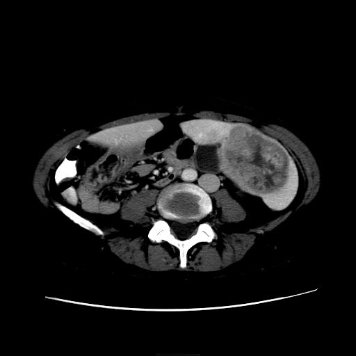
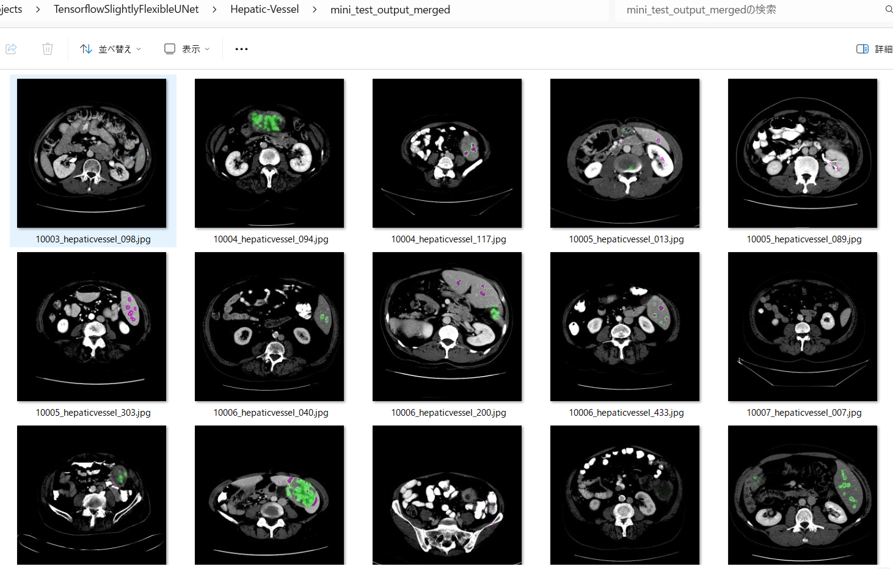
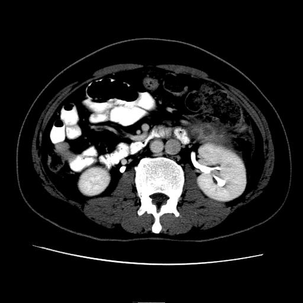

<h2>Tensorflow-Image-Segmentation-Augmented-Hepatic-Vessel (2024/05/23)</h2>

This is the first experimental Image Segmentation project for Hepatic-Vessel based on
the <a href="https://github.com/sarah-antillia/Tensorflow-Image-Segmentation-API">Tensorflow-Image-Segmentation-API</a>, and
<a href="https://drive.google.com/file/d/1pjZPc5Wu1QSSC_EYmfnNfEqBovfbNmxt/view?usp=sharing">Hepatic-Vessel-ImageMask-Dataset-V1.zip</a>
, which was derived by us from <b>Task08_HepaticVessel</b> dataset in  
<a href="http://medicaldecathlon.com/">Medical Segmentation Decathlon</a>.

 

Actual Image Segmentation Examples. 
<table>
<tr>
<th width="330">Input: image</th>
<th width="330">Mask (ground_truth)</th>
<th width="330">Prediction: inferred_mask_merged</th>
</tr>
<tr>
<td></td>

<td></td>
<td></td>
</tr>

<tr>
<td></td>

<td></td>
<td></td>
</tr>
</table>

In order to improve segmentation accuracy, we used an online dataset augmentation strategy based on Python script <a href="./src/ImageMaskAugmentor.py">
ImageMaskAugmentor.py</a> to train a Hepatic-Vessel Segmentation Model. 
 

In this experiment, we have used the simple UNet Model 
<a href="./src/TensorflowUNet.py">TensorflowSlightlyFlexibleUNet</a> for this Hepatic-Vessel Segmentation. 
As shown in <a href="https://github.com/sarah-antillia/Tensorflow-Image-Segmentation-API">Tensorflow-Image-Segmentation-API</a>.
you may try other Tensorflow UNet Models: 

<li><a href="./src/TensorflowSwinUNet.py">TensorflowSwinUNet.py</a></li>
<li><a href="./src/TensorflowMultiResUNet.py">TensorflowMultiResUNet.py</a></li>
<li><a href="./src/TensorflowAttentionUNet.py">TensorflowAttentionUNet.py</a></li>
<li><a href="./src/TensorflowEfficientUNet.py">TensorflowEfficientUNet.py</a></li>
<li><a href="./src/TensorflowUNet3Plus.py">TensorflowUNet3Plus.py</a></li>
<li><a href="./src/TensorflowDeepLabV3Plus.py">TensorflowDeepLabV3Plus.py</a></li>

 

<h3>1. Dataset Citatioin</h3>

The image dataset used here has been taken from the google drive. 
<a href="https://drive.google.com/file/d/1qVrpV7vmhIsUxFiH189LmAn0ALbAPrgS/view?usp=drive_link">Task08_HepaticVessel.tar</a>
uploaded by 
<a href="http://medicaldecathlon.com/">Medical Segmentation Decathlon</a>
 
 
On Medical Segmentation Decathlon, please refer to 
<a href="https://www.nature.com/articles/s41467-022-30695-9">The Medical Segmentation Decathlon</a>
 
 
<b>About Dataset</b>
<pre>
{ 
"name": "HepaticVessel", 
"description": "Hepatic Vessels and Tumour Segmentation",
"reference": "Memorial Sloan Kettering Cancer Center",
"licence":"CC-BY-SA 4.0",
"release":"1.1 14/08/2018",
"tensorImageSize": "3D",
"modality": { 
   "0": "CT"
 }, 
 "labels": { 
   "0": "background", 
   "1": "Vessel", 
   "2": "Tumour"
 }, 
 "numTraining": 303, 
 "numTest": 140,
}
...
</pre>
<a href="./projects/TensorflowSlightlyFlexibleUNet/Hepatic-Vessel/dataset.json">dataset.json</a>
 

 

<h3>
<a id="2">
2 Hepatic-Vessel ImageMask Dataset
</a>
</h3>
 If you would like to train this Hepatic-Vessel Segmentation model by yourself,
 please download the jpg dataset from the google drive 
<a href="https://drive.google.com/file/d/1pjZPc5Wu1QSSC_EYmfnNfEqBovfbNmxt/view?usp=sharing">Hepatic-Vessel-ImageMask-Dataset-V1.zip</a>.
 
On that dataset, please see <a href="https://github.com/sarah-antillia/ImageMask-Dataset-HepaticVessel">ImageMask-Dataset-HepaticVessel</a>. 
 

Please expand the downloaded ImageMaskDataset and place it under <b>./dataset</b> folder to be
<pre>
./dataset
└─Hepatic-Vessel
    ├─test
    │   ├─images
    │   └─masks
    ├─train
    │   ├─images
    │   └─masks
    └─valid
        ├─images
        └─masks
</pre>

<b>Hepatic-Vessel Dataset Statistics</b> 
 
 
As shown above, the number of images of train and valid dataset is large. 
However the online dataset augmentation strategy may 
be effective to improve segmentation accuracy.

 

 
<b>Train_images_sample</b> 

 
<b>Train_masks_sample</b> 

 

<h3>
4 Train TensorflowUNet Model
</h3>
 We have trained Hepatic-Vessel TensorflowUNet Model by using the following
<a href="./projects/TensorflowSlightlyFlexibleUNet/Hepatic-Vessel/train_eval_infer.config"> <b>train_eval_infer.config</b></a> file.  
Please move to ./projects/Hepatic-Vessel and run the following bat file. 
<pre>
>1.train.bat
</pre>
, which simply runs the following command. 
<pre>
>python ../../../src/TensorflowUNetTrainer.py ./train_eval_infer.config
</pre>
<pre>
; train_eval_infer.config
; 2024/05/23 (C) antillia.com

[model]
model          = "TensorflowUNet"
generator      = True
image_width    = 512
image_height   = 512
image_channels = 3
input_normalize= False
num_classes    = 1
base_filters   = 16
base_kernels   = (5,5)
num_layers     = 8
dropout_rate   = 0.05
learning_rate  = 0.0001
clipvalue      = 0.5
dilation       = (2,2)
loss           = "bce_dice_loss"
metrics        = ["binary_accuracy"]
show_summary   = False

[dataset]
;Please specify a class name of your ImageDataset.
;datasetclass   = "BaseImageMaskDataset"
color_order    = "bgr"

[train]
epochs         = 100
batch_size     = 2
steps_per_epoch  = 200
validation_steps = 100
patience       = 10
;metrics       = ["iou_coef", "val_iou_coef"]
metrics        = ["binary_accuracy", "val_binary_accuracy"]
model_dir      = "./models"
eval_dir       = "./eval"
image_datapath = "../../../dataset/Hepatic-Vessel/train/images/"
mask_datapath  = "../../../dataset/Hepatic-Vessel/train/masks/"
create_backup  = False
learning_rate_reducer = True
reducer_patience      = 4
save_weights_only = True

[eval]
image_datapath = "../../../dataset/Hepatic-Vessel/valid/images/"
mask_datapath  = "../../../dataset/Hepatic-Vessel/valid/masks/"

[test] 
image_datapath = "../../../dataset/Hepatic-Vessel/test/images/"
mask_datapath  = "../../../dataset/Hepatic-Vessel/test/masks/"

[infer] 
images_dir    = "./mini_test/images/"
masks_dir     = "./mini_test/masks/"
output_dir    = "./mini_test_output"
merged_dir    = "./mini_test_output_merged"

[segmentation]
colorize   = True
black      = "black"
white      = "green"
blursize   = None

[mask]
blur       = False
binarize   = False

[generator]
debug         = True
augmentation  = True

[augmentor]
vflip    = False
hflip    = True
rotation = True
angles   = [5,10,350, 355]
shrinks  = [0.8]
shears   = [0.1]
deformation = True
distortion  = True

[deformation]
alpah    = 1300
sigmoid  = 8

[distortion]
gaussian_filter_rsigma= 40
gaussian_filter_sigma = 0.5
distortions           = [0.03,]
</pre>
 
Please note that the online augmentor <a href="./src/ImageMaskAugmentor.py">
ImageMaskAugmentor.py</a> reads the parameters in [generator] and [augmentor] sections, 
and yields some images and mask depending on the batch_size,
 which are used for each epoch of the training and evaluation process of this UNet Model. 
<pre>
[augmentor]
vflip    = False
hflip    = True
rotation = True
angles   = [5,10,350, 355]
shrinks  = [0.8]
shears   = [0.1]

deformation = True
distortion  = True

[deformation]
alpah    = 1300
sigmoid  = 8

[distortion]
gaussian_filter_rsigma= 40
gaussian_filter_sigma = 0.5
distortions           = [0.03,]
</pre>
Depending on these parameters in [augmentor], [deformation], and [distortion] sections, ImageMaskAugmentor.py generates hflipped, rotated, shrinked,
sheared, deformed and distorted images and masks
from the original images and masks in the folders specified by image_datapath and mask_datapath in 
[train] and [eval] sections. 
<pre>
[train]
image_datapath = "../../../dataset/Hepatic-Vessel/train/images/"
mask_datapath  = "../../../dataset/Hepatic-Vessel/train/masks/"
[eval]
image_datapath = "../../../dataset/Hepatic-Vessel/valid/images/"
mask_datapath  = "../../../dataset/Hepatic-Vessel/valid/masks/"
</pre>

On deformation and distortion, please see also 
<a href="https://github.com/sarah-antillia/ImageMask-Dataset-Offline-Augmentation-Tool">
ImageMask-Dataset-Offline-Augmentation-Tool.</a>.
 

 
The training process has been stopped at epoch 52 by Early-Stopping Callback as shown below.  
 
 
 
<a href="./projects/TensorflowSlightlyFlexibleUNet/Hepatic-Vessel/eval/train_metrics.csv">train_metrics.csv</a> 
 

 
<a href="./projects/TensorflowSlightlyFlexibleUNet/Hepatic-Vessel/eval/train_losses.csv">train_losses.csv</a> 
 

 
The following debug setting is helpful whether your parameters in [augmentor] section are good or not good.
<pre>
[generator]
debug     = True
</pre>
You can check the yielded images and mask files used in the actual train-eval process in the following folders under
<b>./projects/TensorflowSharpUNet/Hepatic-Vessel/</b>.  
<pre>
generated_images_dir
generated_masks_dir
</pre>

Sample images in generated_images_dir 
 
Sample masks in generated_masks_dir 
 
 
<h3>
5 Evaluation
</h3>
Please move to a <b>./projects/TensorflowSlightlyFlexibleUNet/Hepatic-Vessel</b> folder, 
and run the following bat file to evaluate TensorflowUNet model for Hepatic-Vessel. 
<pre>
./2.evaluate.bat
</pre>
<pre>
python ../../../src/TensorflowUNetEvaluator.py ./train_eval_infer_aug.config
</pre>
Evaluation console output: 

  
<a href="./projects/TensorflowSlightlyFlexibleUNet/Hepatic-Vessel/evaluation.csv">evaluation.csv</a> 
The loss (bce_dice_loss) score for this test dataset is not low, but accuracy high as shown below. 
<pre>
loss,0.3188
binary_accuracy,0.9879
</pre>
On the annotation quality of the original <a href="https://www.nature.com/articles/s41467-022-30695-9">
The Medical Segmentation Decathlon </a> (MSD) dataset,
please refer to a comment in 
<a href="https://www.mdpi.com/2076-3417/13/1/548">Automatic Hepatic Vessels Segmentation Using RORPO Vessel Enhancement Filter and 3D V-Net with Variant Dice Loss Function</a>
 

 
<h3>
6 Inference
</h3>
Please move to a <b>./projects/TensorflowSlightlyFlexibleUNet/Hepatic-Vessel</b> folder 
,and run the following bat file to infer segmentation regions for images by the Trained-TensorflowUNet model for Hepatic-Vessel. 
<pre>
./3.infer.bat
</pre>
<pre>
python ../../../src/TensorflowUNetInferencer.py ./train_eval_infer_aug.config
</pre>
mini_test_images 
 
mini_test_mask(ground_truth) 
 

Inferred test masks (colorized as green) 
 
 

Inferred test masks_merged 
 
 

<b>Enlarged images and masks </b> 

<table>
<tr>
<th width="330">Image</th>
<th width="330">Mask (ground_truth)</th>
<th width="330">Inferred-mask-merged</th>
</tr>

<tr>
<td></td>
<td></td>
<td></td>
</tr>

<tr>
<td></td>
<td></td>
<td></td>
</tr>

<tr>
<td></td>
<td></td>
<td></td>
</tr>

<tr>
<td></td>
<td></td>
<td></td>
</tr>
<tr>
<td></td>
<td></td>
<td></td>
</tr>

</table>
 
 

<h3>
References
</h3>
<b>1. Hepatic vessels segmentation using deep learning and preprocessing enhancement</b> 
Omar Ibrahim Alirr, Ashrani Aizzuddin Abd Rahni 
First published: 18 March 2023 https://doi.org/10.1002/acm2.13966 
<pre>
https://aapm.onlinelibrary.wiley.com/doi/10.1002/acm2.13966
</pre>

<b>2. Automatic Hepatic Vessels Segmentation Using RORPO Vessel Enhancement Filter and 3D V-Net with Variant Dice Loss Function</b> 
Petra Svobodova †ORCID,Khyati Sethia †ORCID,Petr Strakos *,†ORCID andAlice VarysovaORCID 
IT4Innovations, VSB—Technical University of Ostrava, 70800 Ostrava-Poruba, Czech Republic 
Appl. Sci. 2023, 13(1), 548; https://doi.org/10.3390/app13010548 
<pre>
https://www.mdpi.com/2076-3417/13/1/548
</pre>
